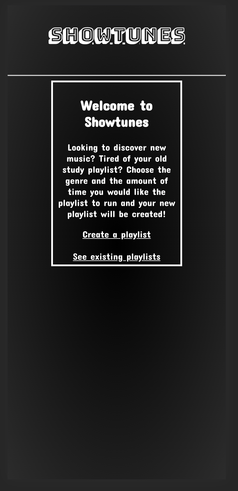
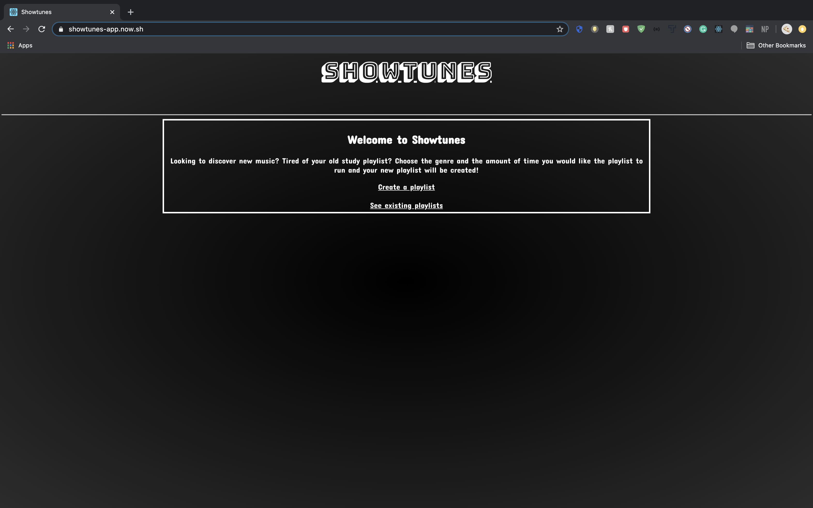
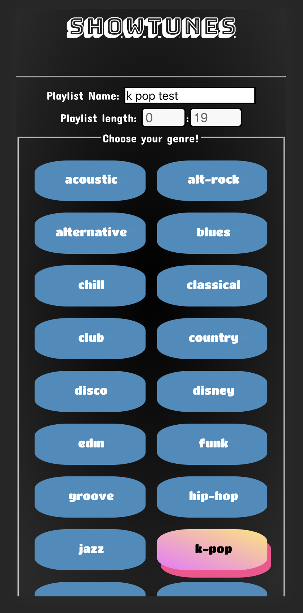
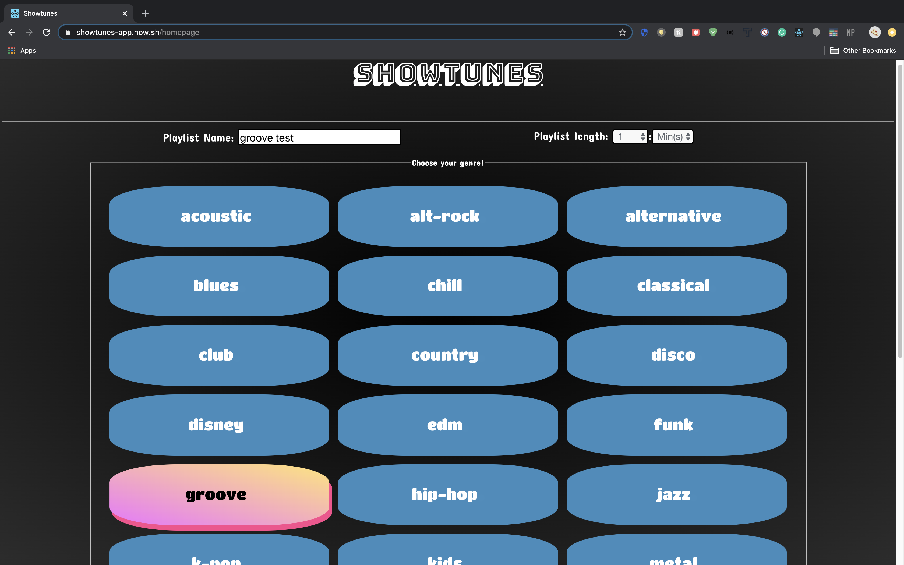
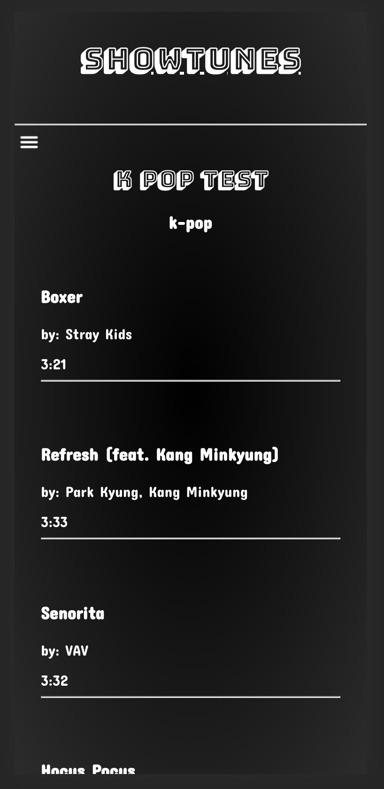
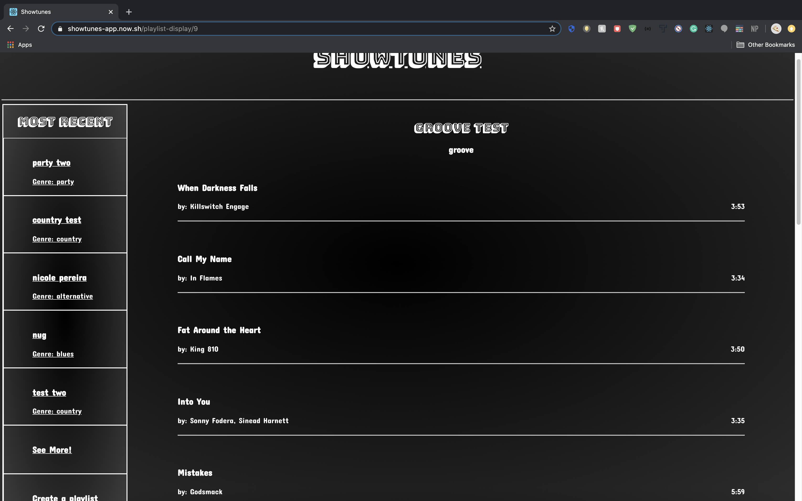
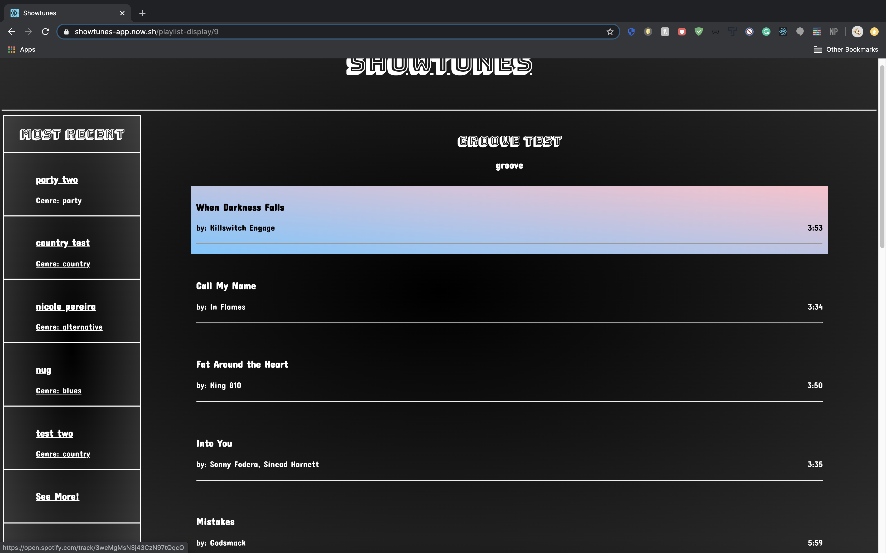
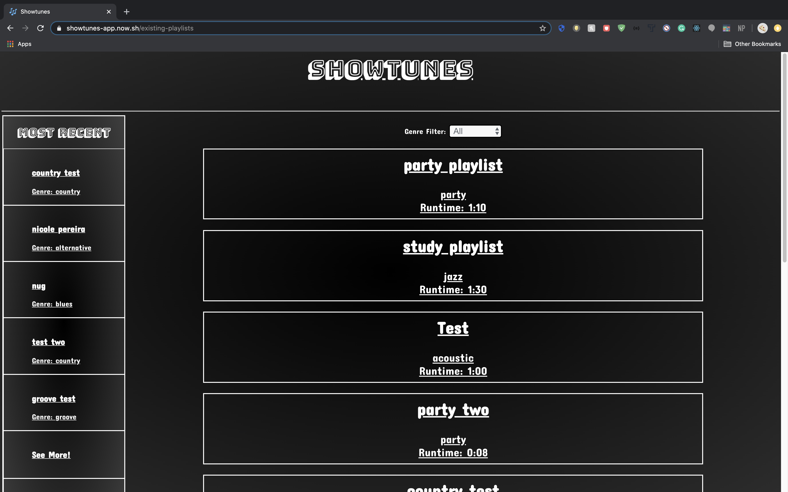
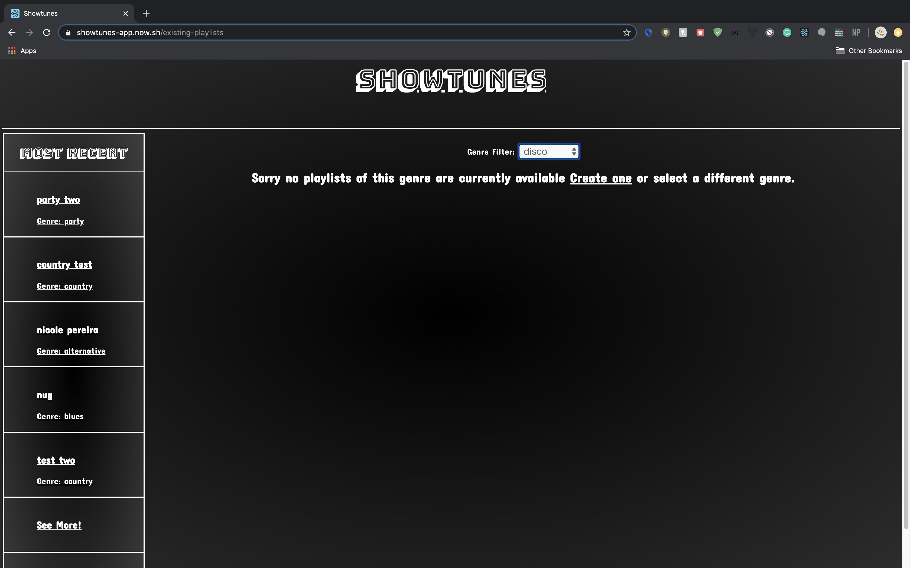
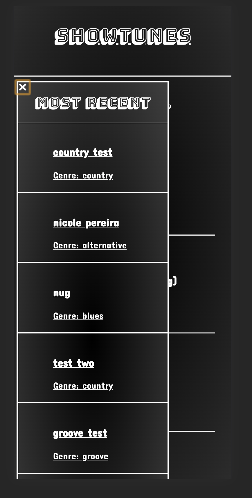

## Name: Showtunes

### Link: [https://showtunes-app.now.sh/](https://showtunes-app.now.sh/)

### Api:
- my api has 4 endpoints that the user interacts with directly: genres , playlists, auth, and data
- genres: loads the genres onto the genre selection page 
- playlists: allows the user to post the playlist info to the endpoint and pull all playlists from the endpoint
- auth: since this app also utilizes the spotify api this endpoint checks on load that the authorization is ready to go on load and if it isnt makes the proper request to the spotify api to get the authorization needed
- data: this is the endpoint that makes the request to get the songs from the spotify api for each playlist

### Summary :
This app allows users to submit a genre and runtime the app then takes this and makes a call to the spotify api and creates a playlist with songs whose total runtime is approximately the same length as specified.

### Screenshots:

### technology used:
- React, CSS, Node, Express, and PostgreSQL